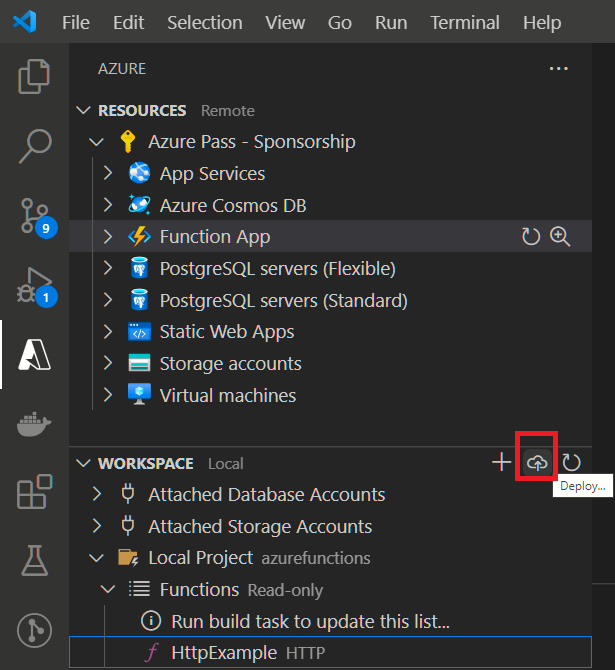

### Exercise 2-01: Create an Azure Function by using Visual Studio Code

In this exercise you'll learn how to create a simple C# function that responds to HTTP requests. After creating and testing the code locally in Visual Studio Code you will deploy to Azure.

#### Prerequisites

Before you begin make sure you have the following requirements in place:

- An Azure account with an active subscription. If you don't already have one, you can sign up for a free trial at https://azure.com/free.
- The [Azure Functions Core Tools](https://docs.microsoft.com/azure/azure-functions/functions-run-local#install-the-azure-functions-core-tools) version 3.x.
- [Visual Studio Code](https://code.visualstudio.com/) on one of the [supported platforms](https://code.visualstudio.com/docs/supporting/requirements#_platforms).
- [.NET Core 3.1](https://dotnet.microsoft.com/download/dotnet/3.1) is the target framework for the steps below.
- The [C# extension](https://marketplace.visualstudio.com/items?itemName=ms-dotnettools.csharp) for Visual Studio Code.
- The [Azure Functions extension](https://marketplace.visualstudio.com/items?itemName=ms-azuretools.vscode-azurefunctions) for Visual Studio Code.

#### Task 1 - Create your local project

In this section, you use Visual Studio Code to create a local Azure Functions project in C#. Later in this exercise, you'll publish your function code to Azure.

1. Choose the Azure icon in the Activity bar, then in the **Azure: Workspace** area, select **Create new Function…**.

   

2. Then select Yes to create a new project.

3. If not directory location was picked, choose a directory location for your project workspace and choose **Select**.

   **Note:** Be sure to select a project folder that is outside of a workspace.

4. Provide the following information at the prompts:

   - **Select a language**: Choose C#.
   - **Select a .NET runtime**: Choose .NET Core 3.1
   - **Select a template for your project's first function**: Choose HTTP trigger.
   - **Provide a function name**: Type HttpExample.
   - **Provide a namespace**: Type My.Functions.
   - **Authorization level**: Choose Anonymous, which enables anyone to call your function endpoint.
   - **Select how you would like to open your project**: Choose Add to workspace.

5. Using this information, Visual Studio Code generates an Azure Functions project with an HTTP trigger.

#### Task 2: Run the function locally

Visual Studio Code integrates with Azure Functions Core tools to let you run this project on your local development computer before you publish to Azure.

1. To call your function, press **F5** to start the function app project. Output from Core Tools is displayed in the **Terminal** panel. Your app starts in the **Terminal** panel. You can see the URL endpoint of your HTTP-triggered function running locally.

   

2. With Core Tools running, go to the **Azure: Functions** area. Under **Functions**, expand **Local Project** > **Functions**. (If it is hidden, press in refress WorkSpace). Right-click the HttpExample function and choose **Execute Function Now…**.

   

3. In **Enter request body** type the request message body value of { "name": "Azure" }. Press **Enter** to send this request message to your function. When the function executes locally and returns a response, a notification is raised in Visual Studio Code. Information about the function execution is shown in **Terminal** panel.

4. **Press Ctrl + C** to stop Core Tools and disconnect the debugger.

After you've verified that the function runs correctly on your local computer, it's time to use Visual Studio Code to publish the project directly to Azure.

#### Task 3: Sign in to Azure

Before you can publish your app, you must sign in to Azure. If you're already signed in, go to the next section.

1. If you aren't already signed in, choose the Azure icon in the Activity bar, then in the **Azure: Functions** area, choose **Sign in to Azure…**.

   

2. When prompted in the browser, choose your Azure account and sign in using your Azure account credentials.

3. After you've successfully signed in, you can close the new browser window. The subscriptions that belong to your Azure account are displayed in the Side bar.

#### Task 4: Publish the project to Azure

In this section, you create a function app and related resources in your Azure subscription and then deploy your code.

After to publish your function must be has a function resource created in Azure. 

Select + in Resource to create a new Azure Function Resource in Azure

Follow the steps:

- A globally unique name
- Stack (Choose .Net Core 3.1)
- Select Location
- The Azure Function resource will be created in two or three minutes

**Important:** Publishing to an existing function app overwrites the content of that app in Azure.

1. Choose the Azure icon in the Activity bar, then in the **Azure: Functions** area, choose the **Deploy to Function app…** button.

   

2. Provide the following information at the prompts:

   - **Select Function App in Azure**: Choose **Select a Resource ** previously created. (Azure function resource name)
   - Waiting 

   The extension shows the status of individual resources as they are being created in Azure in the notification area.

   

3. When completed, the following Azure resources are created in your subscription, using names based on your function app name:

   - A resource group, which is a logical container for related resources.
   - A standard Azure Storage account, which maintains state and other information about your projects.
   - A consumption plan, which defines the underlying host for your serverless function app.
   - A function app, which provides the environment for executing your function code. A function app lets you group functions as a logical unit for easier management, deployment, and sharing of resources within the same hosting plan.
   - An Application Insights instance connected to the function app, which tracks usage of your serverless function.

   A notification is displayed after your function app is created and the deployment package is applied.

   

#### Task 5: Run the function in Azure

1. Back in the **Azure: Functions** area in the side bar, expand your subscription, your new function app, and **Functions**. **Right-click** the HttpExample function and choose **Execute Function Now…**.

   

2. In **Enter request body** you see the request message body value of { "name": "Azure" }. Press Enter to send this request message to your function.

3. When the function executes in Azure and returns a response, a notification is raised in Visual Studio Code.

   

#### Task 6: Clean up resources

Use the following steps to delete the function app and its related resources to avoid incurring any further costs.

1. In Visual Studio Code, press **F1** to open the command palette. In the command palette, search for and select Azure Functions: Open in portal.
2. Choose your function app from the list, and press **Enter**. The function app page opens in the Azure portal.
3. In the **Overview** tab, select the named link next to **Resource group**.
4. In the **Resource group** page, review the list of included resources, and verify that they are the ones you want to delete.
5. Select **Delete resource group**, and follow the instructions.

Deletion may take a couple of minutes. When it's done, a notification appears for a few seconds. You can also select the bell icon at the top of the page to view the notification.