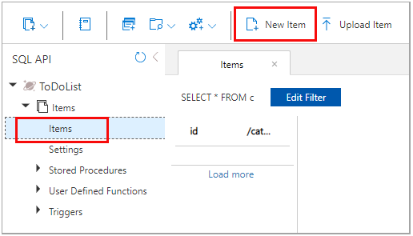

### Exercise: Create Azure Cosmos DB resources by using the Azure Portal

In this exercise you'll learn how to perform the following actions in the Azure Portal:

- Create an Azure Cosmos DB account
- Add a database and a container
- Add data to your database
- Clean up resources

#### Prerequisites

This exercise is performed in the Azure Portal.

##### Login to Azure

1. Login to the Azure Portal. [https://portal.azure.com](https://portal.azure.com/)

#### Task 1: Create an Azure Cosmos DB account

1. Log in to the [Azure portal](https://portal.azure.com/).

2. From the Azure portal navigation pane, select **+ Create a resource**.
3. Search for **Azure Cosmos DB**, then select **Create/Azure Cosmos DB** to get started.
4. On the Select API option page, select **Create** in the **Core (SQL) - Recommended** box.
5. In the **Create Azure Cosmos DB Account - Core (SQL)** page, enter the basic settings for the new Azure Cosmos account.
   - **Subscription**: Select the subscription you want to use.
   - **Resource Group**: Select **Create new**, then enter *az204-cosmos-rg*.
   - **Account Name**: Enter a *unique* name to identify your Azure Cosmos account. The name can only contain lowercase letters, numbers, and the hyphen (-) character. It must be between 3-31 characters in length.
   - **Location**: Use the location that is closest to your users to give them the fastest access to the data.
   - **Capacity mode**: Select **Serverless**.
6. Select **Review + create**.
7. Review the account settings, and then select **Create**. It takes a few minutes to create the account. Wait for the portal page to display **Your deployment is complete**.
8. Select **Go to resource** to go to the Azure Cosmos DB account page.

#### Task 2: Add a database and a container

You can use the Data Explorer in the Azure portal to create a database and container.

1. Select **Data Explorer** from the left navigation on your Azure Cosmos DB account page, and then select **New Container**.

2. In the **Add container** pane, enter the settings for the new container.

   - **Database ID**: Enter *ToDoList* and check the **Provision database throughput** option, it allows you to share the throughput provisioned to the database across all the containers within the database.
   - **Throughput**: Enter *400*
   - **Container ID**: Enter *Items*
   - **Partition key**: Enter */category*. The samples in this demo use */category* as the partition key.

   ✔️ **Note:** Don't add **Unique keys** for this scenario. Unique keys let you add a layer of data integrity to the database by ensuring the uniqueness of one or more values per partition key.

3. Select **OK**. The Data Explorer displays the new database and the container that you created.

#### Task 3: Add data to your database

Add data to your new database using Data Explorer.

1. In **Data Explorer**, expand the **ToDoList** database, and expand the **Items** container. Next, select **Items**, and then select **New Item**.

   

2. Add the following structure to the document on the right side of the **Documents** pane:

   

   ```json
   {
       "id": "1",
       "category": "personal",
       "name": "groceries",
       "description": "Pick up apples and strawberries.",
       "isComplete": false
   }
   ```

   

3. Select **Save**.

4. Select **New Document** again, and create and save another document with a unique id, and any other properties and values you want. Your documents can have any structure, because Azure Cosmos DB doesn't impose any schema on your data.

#### Task 4: Clean up resources

1. Select **Overview** from the left navigation on your Azure Cosmos DB account page.
2. Select the **az204-cosmos-rg** resource group link in the Essentials group.
3. Select **Delete** resource group and follow the directions to delete the resource group and all of the resources it contains.

❗️ **Important:** If you want use this resources later in this lesson, don't delete the Azure Cosmos DB account or the az204-cosmos-rg resource group just yet