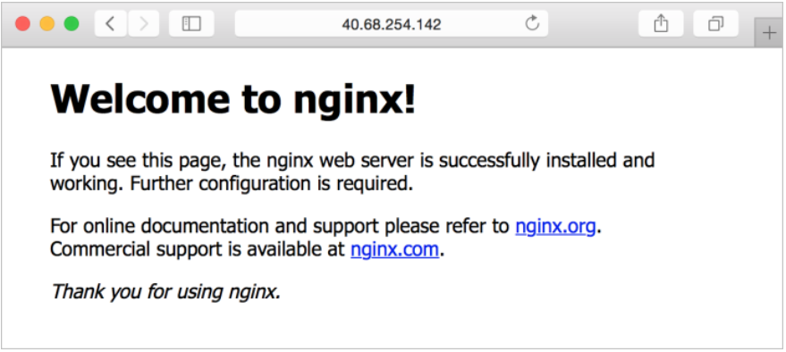

### Exercise: Create a virtual machine by using the Azure CLI

In this exercise you'll create a Linux virtual machine by performing the following operations using Azure CLI commands:

- Create a resource group and a virtual machine
- Install a web server
- View the web server in action
- Clean up resources

#### Prerequisites

- An **Azure account** with an active subscription. If you don't already have one, you can sign up for a free trial at https://azure.com/free.

#### Login to Azure and start the Cloud Shell

1. Login to the [Azure portal](https://portal.azure.com/) and open the Cloud Shell.

   

2. After the shell opens be sure to select the **Bash** environment.

   )

#### Create a resource group and virtual machine

1. Create a resource group with the az group create command. The command below creates a resource group named *az204-vm-rg*. Replace <myLocation> with a region near you.

   `az group create --name az204-vm-rg --location <myLocation>`

2. Create a VM with the az vm create command. The command below creates a Linux VM named *az204vm* with an admin user named *azureuser*. After executing the command you will need to supply a password that meets the password requirements.

   `az vm create \    --resource-group az204-vm-rg \    --name az204vm \    --image UbuntuLTS \    --generate-ssh-keys \    --admin-username azureuser`

   It will take a few minutes for the operation to complete. When it is finished note the publicIpAddress in the output, you'll use it in the next step.

   **Note:** When creating VMs with the Azure CLI passwords need to be between 12-123 characters, have both uppercase and lowercase characters, a digit, and have a special character (@, !, etc.). Be sure to remember the password.

#### Install a web server

1. By default, only SSH connections are opened when you create a Linux VM in Azure. Use az vm open-port to open TCP port 80 for use with the NGINX web server:

   `az vm open-port --port 80 \ --resource-group az204-vm-rg \ --name az204vm`

2. Connect to your VM by using SSH. Replace <publicIPAddress> in the example with the public IP address of your VM as noted in the previous output:

   `ssh azureuser@<publicIPAddress>`

3. To see your VM in action, install the NGINX web server. Update your package sources and then install the latest NGINX package.

   `sudo apt-get -y update sudo apt-get -y install nginx`

4. When done type exit to leave the SSH session.

#### View the web server in action

Use a web browser of your choice to view the default NGINX welcome page. Use the public IP address of your VM as the web address. The following example shows the default NGINX web site:



#### Clean up Azure resources

You can now safely delete the *az204-vm-rg* resource group from your account by running the command below.

```
az group delete --name az204-vm-rg --no-wait
```